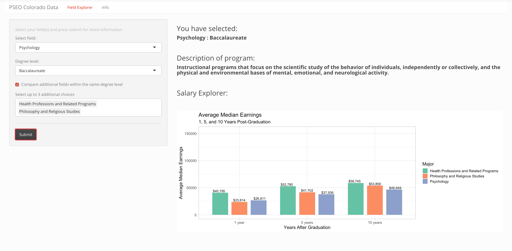

# Colorado Post-Secondary Outcomes Data Explorer

## App Link

The app can be found here:

## Introduction

One important factor that goes into many people's decisions when choosing a major or field of study is how much they will make after they graduate. There are many ways to try to picture how one's future earnings will look like- this app in particular uses data collected by the US Census Bureau to help users understand how much graduates from Colorado schools have made 1, 5, and 10 years after graduation. The goal for this app is to help the user make more informed decisions about their future path by exploring this data set.

## About the app
This app has two main functionalities. Upon first opening the app, the user is met with a window that allows the user to select the field that they wish to view and which degree level (eg: Associates or Masters). Upon clicking submit, a graph is generated that displays the average median earnings for that field 1, 5, and 10 years after graduation. Text is also outputted that lets the user see what they selected and a short description of the program. The second functionality that is available to the user is the comparison function. Upon selecting this option, the user can select up to 3 additional fields to directly see how those earnings compare to the first major they selected in a side-by-side boxplot view. 

This app was created to be as user-friendly as possible. For this reason, reactive features were added to avoid the user accidentally selecting criteria that would not allow them to see earnings data. On the server side of this app, the method updateSelectInput() was used so that depending on what the user picks as their field of study, the second selection to display degree options is updated to only show what is available. The same goes for when the user wishes to use the comparison feature- the select bar only gives users the options to pick fields that are not the one they already selected and are available within the selected degree type. These features helps limit the possible errors that the user can face.

In addition, there is an information tab which allows users to read about the purpose of the app and where the data comes from. There is  an option for the user to view a data table of the data used to make the app, so they can also explore the raw data if they please. Within the main tab, if a user only selects one field to view, a help message pops up below the graph letting the users know that they also have the option to compare their selection with others. There is also help text on the widget panel, which once again serves the purpose of making the UI easy for users to navigate.

## About the data
##### From the info section in the app:
This app is based off of data from the US Census Bureau study known as Post-Secondary Employment Outcomes (PSEO). The data set used for this app in particular contains information on graduates from post-secondary institutions located in the state of Colorado. This includes information about their major, graduation cohort, industry, degree level, and quartile earnings 1,5, and 10 years after graduation.  The original data set has been filtered for use of this app because for many observations, earnings data is not available for all years. According to the Census Bureau, this is mainly because of “insufficient labor market attachment in the reference year.” The Census Bureau combined transcript data given by different schools in Colorado with their national database containing information about jobs to create an informative data set about college students and their future employment tracks.

### References

[PSEO data](https://lehd.ces.census.gov/data/pseo_experimental.html) 

[Shiny cheat sheet](https://shiny.rstudio.com/images/shiny-cheatsheet.pdf)

[Split a string](https://stackoverflow.com/questions/33683862/first-entry-from-string-split)

[Format text output](https://stackoverflow.com/questions/28653428/r-shiny-display-specific-rows-from-a-dataset)

[Getting a row as a vector](https://stackoverflow.com/questions/7615450/getting-a-row-from-a-data-frame-as-a-vector-in-r)

[Adding numbers on geom_bar](https://intellipaat.com/community/16343/how-to-put-labels-over-geombar-for-each-bar-in-r-with-ggplot2)

[Formatting plot numbers](https://stackoverflow.com/questions/29465941/format-number-in-r-with-both-comma-thousands-separator-and-specified-decimals)

[Filtering from a vector](https://community.rstudio.com/t/filter-rows-of-a-data-frame-by-vector-of-strings/52956)

[Removing a string from a char vector](https://stackoverflow.com/questions/35790652/removing-words-featured-in-character-vector-from-string)

[HTML()](https://stackoverflow.com/questions/33392784/make-bold-text-in-html-output-r-shiny)

[Update Select Input()](https://shiny.rstudio.com/reference/shiny/1.2.0/updateSelectInput.html)

[Adding an image to md](https://guides.github.com/features/mastering-markdown/)

